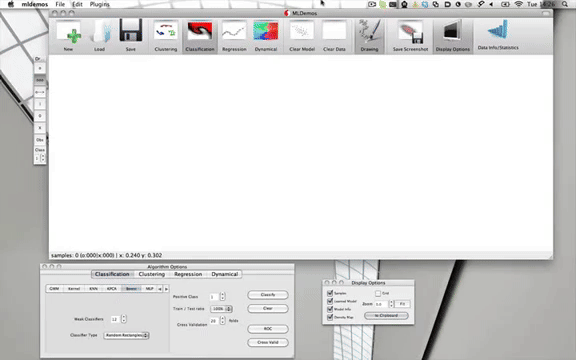

# MLDemos
A Machine learning toolkit

MLDemos is an open-source visualization tool for machine learning algorithms created to help studying and understanding how several algorithms function and how their parameters affect and modify the results in problems of classification, regression, clustering, dimensionality reduction, dynamical systems and reward maximization.
MLDemos is open-source and free for personal and academic use.

* [MLDemos](https://github.com/epfl-lasa/MLDemos/tree/master/MLDemos) contains the binaries

* [mldemos](https://github.com/epfl-lasa/MLDemos/tree/master/mldemos) contains the source code

# Instructions

Follow the installation proceedures described in source code [mldemos](https://github.com/epfl-lasa/MLDemos/tree/master/mldemos).

# Implemented Methods

Classification
• Support Vector Machine (SVM) (C, nu, Pegasos)
• Relevance Vector Machine (RVM)
• Gaussian Mixture Models (GMM)
• Multi-Layer Perceptron + BackPropagation
• Gentle AdaBoost + Naive Bayes
• Approximate K-Nearest Neighbors (KNN)
• Gaussian Process Classification (GP)
• Random Forests
Regression
• Support Vector Regression (SVR)
• Relevance Vector Regression (RVR)
• Gaussian Mixture Regression (GMR)
• MLP + BackProp
• Approximate KNN
• Gaussian Process Regression (GPR)
• Sparse Optimized Gaussian Processes (SOGP) |
• Locally Weighed Scatterplot Smoothing (LOWESS)
• Locally Weighed Projection Regression (LWPR)
Dynamical Systems
• GMM+GMR
•LWPR
• SVR
• SEDS
• SOGP (Slow!)
• MLP
• KNN
• Augmented-SVM (ASVM)
Clustering
• K-Means
• Soft K-Means
• Kernel K-Means
• K-Means++
• GMM
• One Class SVM
• FLAME
• ORSCAN
Projections
• Principal Component Analysis (PCA)
• Kernel PCA
• Independent Component Analysis (ICA)
• Canonical Correlation Analysis (CCA)
• Linear Discriminant Analysis (LDA)
• Fisher Linear Discriminant
• EigenFaces to 2D (using PCA)
Projections
• Principal Component Analysis (PCA)
• Kernel PCA
• Independent Component Analysis (ICA)
• Canonical Correlation Analysis (CCA)
• Linear Discriminant Analysis (LDA)
• Fisher Linear Discriminant
• EigenFaces to 2D (using PCA)
Reward Maximization (Reinforcement Learning)
• Random Search
• Random Walk
• PoWER
• Genetic Algorithms (GA)
• Particle Swarm Optimization
• Particle Filters
• Donut
• Gradient-Free Methods (nlopt)

# Very quick start

1. Launch the software
2. Draw samples by clicking either the left or right mouse button.
    left-click generates samples of class 0
    right-click generates samples of the class selected in the toolbar (default: 1)
3. Select the Display Options icon
    this will allow you to display model information, confidence/likelihood maps and to hide the original samples
    the mouse wheel will allow you to zoom in and out
    alt+dragging will allow you to pan around the space
4. Select the Algorithms Options icon
5. Select one of the algorithm icons to open their respective option panels
6. Click the Classify button to run the algorithm on the current data

### Importing data

Generating data in MLDemos is done in three different ways: by manually drawing samples, by projecting image data through PCA (via the PCAFaces plugin), or by loading external data.
Comma separated values, or other text-file based value tables can be drag-and-dropped into the interface. In this case a Data Loading dialog will appear to allow choosing which columns or rows should loaded, interpreted as class labels or headers, etc.

Alternatively, a native data format used by the software is ascii-based and contains:
1. The # of samples followed by # of dimensions
2. For each sample, one line containing
    1. The sample values space-separated (float, one per each dimension)
    2. The sample class index (integer 0 ... 255)
    3. A flag value (integer 0-3) to terminate the line (unused for the time being)
A simple example would be\
4 3\
0.10 0.11 0.12 0 0\
0.14 0.91 0.11 0 0\
0.43 0.74 0.41 1 0\
0.28 0.34 0.33 1 0\
which presents 4 three-dimensional samples, two from class 0 and one from class 1.

When the file is saved from MLDemos, the software adds the current algorithm parameters (provided an algorithm was selected), which can be useful for demonstration purposes. If no such information is present, the default algorithm parameters are selected.

Drawing manually some samples, or importing a standard dataset and saving it from within MLDemos should give you ample examples on the file syntax.

# Acknoledgement

Created by Dr. Basilio Noris at the Learning Algorithms and Systems Laboratory, the development of this program has been aided, supported and sponsored by the following entities, organizations, and groups: gitstack, EPFL and Pomelo

This program would not exist if a number of people had not put a lot of effort into implementing the different algorithms that are combined here into a single program.
- Florent D'Hallouin (GMM + GMR) - LASA
- Dan Grollman (SOGP) - LASA
- Mohammad Khansari (SEDS + DSAvoid) - LASA
- Ashwini Shukla (ASVM, ARD Kernels) - LASA
- Stephane Magnenat (ESMLR) - website
- Chih-Chung Chang and Chih-Jen Lin (libSVM) - website
- David Mount and Sunik Arya (ANN library) - website
- Davis E. King (DLIB) - website
- Stefan Klanke and Sethu Vijayakumar (LWPR) - website
- Robert Davies (Newmat) - website
- JF Cardoso (ICA) - website
- Steven G. Johnson (NLOpt) - website
- The WillowGarage crowd (OpenCV) - website
- Trolltech/Nokia/Digia (Qt) - website
- The authors of several of the icons - website
- The PhD students following the 2012 ML class at EPFL (Julien Eberle, Pierre-Antoine Sondag, Guillaume deChambrier, Klas Kronander, Renaud Richardet, Raphael Ullman)
Moreover, the program itself would be far less performant without the work of the support and development team at LASA: Christophe Paccolat, Nicolas Sommer and Otpal Vittoz.

Thanks also to the people who have not contributed code but have contributed no less directly: Aude Billard, for being one of the best bosses one could wish for, François Fleuret, for a bunch of fruitful discussions, and the AML 2010,  and 2011 classes for patiently giving it a first test-drive.